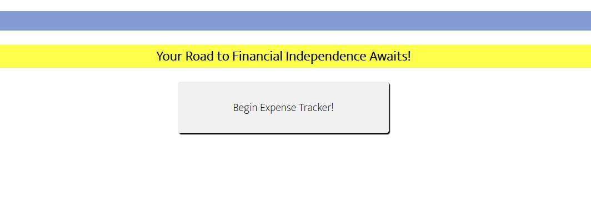
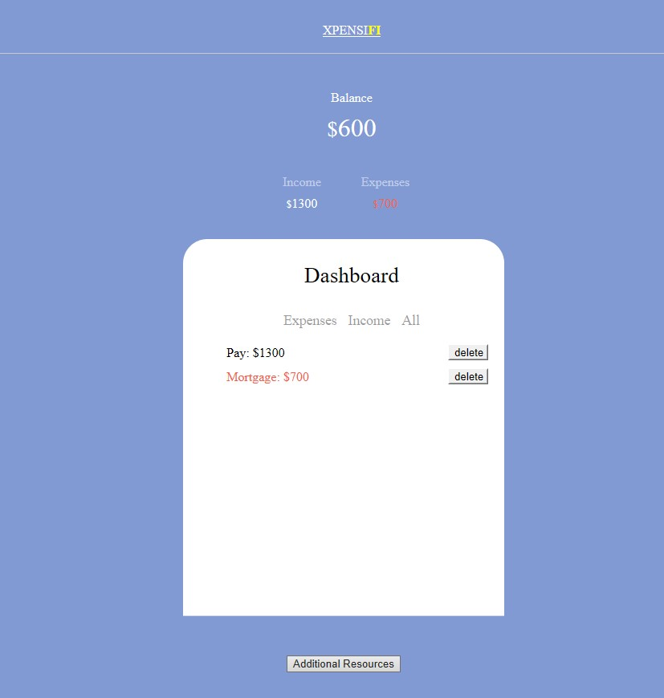

# Unit 7: Project 1

## Overview
Welcome to Project 1! This is an important step in your full-stack journey as you will now use your newly acquired skills and knowledge to build web application from scratch. With your team, you will conceive and execute a design that solves a real-world problem by integrating data received from multiple server-side API requests. Because you will be working collaboratively, you will learn agile development methodologies and implement feature and bug fixes using the git branch workflow and pull requests.

## Key Topics
* Server-side APIs
* Git branching workflow
* Agile software development

## Comprehension Check
You will be employer-ready if you can answer the following questions:
1. What is agile software development?
2. What is an MVP?
3. If you pull down a teammate's branch and you have merge conflicts, how do you handle it?

## Learning Objectives
You will be employer-competitive if you are able to:
* Speak technically about a feature you implemented in your project
* Explain and execute git branching workflow in a collaborative project
* Resolve merge conflicts
* Explain agile software development
* Design, build, and deploy a client-side web application using GitHub Pages
* Prepare a professional presentation and repository README for your project

## Project Requirements

```
* Use a CSS framework other than Bootstrap.
* Be deployed to GitHub Pages.
* Be interactive (i.e: accept and respond to user input).
* Use at least two server-side APIs.
* Does not use alerts, confirms, or prompts (use modals).
* Use client-side storage to store persistent data.
* Be responsive.
* Have a polished UI.
* Have a clean repository that meets quality coding standards (file structure, naming conventions, follows best practices for class/* id-naming conventions, indentation, quality comments, etc.).
* Have a quality README (with unique name, description, technologies used, screenshot, and link to deployed application).

```
Sample screenshot from the XpensiFI Budget Tracker:




REPOSITORY TITLE: niloccolin/group-project-1

    Created code from scratch. 

Repository Link: https://github.com/niloccolin/group-project-1

Github Page: https://niloccolin.github.io/group-project-1/

TABLE OF CONTENTS:
    
    -  Clone
 
    -  Setup
 
    -  Contributing

    -  Description
 
    -  Support

Clone:
    Clone this repo to your local machine using https://github.com/niloccolin/group-project-1.git

Setup:
    Ensure that the following files are located in the root folder: Index, budget-tracker, resources, and tracker.

Contributing:
    The group 1 project team consisted of: Brandon Armstron, Colin Ellis, Laura Fry, Luis Gonzales and Kaitlin Price.

Description:
    This code will provide a detailed budget tracker for the user. The user will not only be able to track their sources of expenses, but also their income. They will be able to edit or delete their income or expenses once they have entered their data and the dashboard will summarize their summary balance (total income - total expenses). On the additional resources page there is a calendar to reference specific dates, as needed, for paying bills. Also, there is a payment calculator, a stock ticker and local weather forecast. 

Example screenshots are as follows:




Support:
    Reach out to us as follows if you have any questions!

    Brandon Armstrong   Email: barmstrong1188@gmail.com   Cell: (786) 252-3525
    Collin Ellis        Email:                            Cell:
    Laura Fry           Email: lafry5@yahoo.com           Cell: (602) 363-0253
    Luis Gonzales       Email:                            Cell:
    Kaitlin Price       Email: kaitlinprice3@gmail.com    Cell: (703) 509-8831

